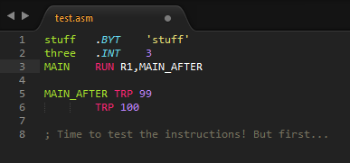

# The-Capstone-Syntax-Package

This is a Sublime Text package containing a build system and syntax specification for use with UVU's CS-concentration capstone project. This includes:

* CS 4380 (High Performance Computer Architecture)
* CS 4490 (Compiler Construction)
* CS 4510 (Operating System Design and Simulation)

## Installation

Clone this repo from Git into your Sublime package directory (`Preferences` > `Browse Packages...`).

# Contributors

* Erich Gubler (@ErichDonGubler), creator.

## See also
If you are interested in using capstone syntax highlighting in other editors, you might be interested in:
* [Atom](https://github.com/MCluck90/language-uvu-asm) written by @mcluck90
