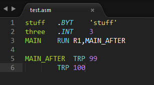

#The-Capstone-Syntax-Package



This is a Sublime Text package containing a build system and syntax specification for use with UVU's CS-concentration capstone project. This includes:

* CS 4380 (High Performance Computer Architecture)
* CS 4490 (Compiler Construction)
* CS 4510 (Operating System Design and Simulation)


##Installation

The simplest way is to start from Sublime:

1. Click ```Menu``` > ```Preferences``` > ```Browse Packages...```
2. Create a new directory - this will be the package name.
3. Clone/paste the contents of this repo into the new directory.

#Contributors

* Erich Gubler (@ErichDonGubler), creator.

##See also
If you are interested in using capstone syntax highlighting in other editors, you might be interested in:
* [Atom capstone assembly package](https://github.com/MCluck90/language-uvu-asm) written by @mcluck90
